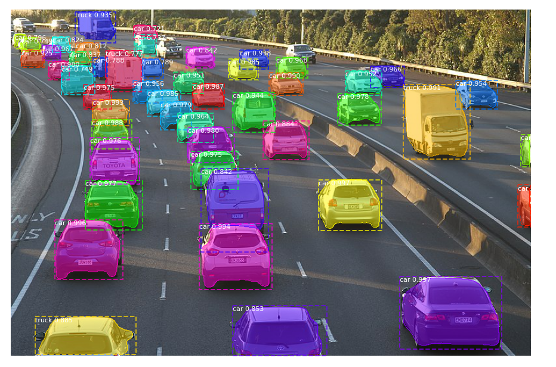

# Mask-RCNN
Vehicule detection modele

.png)

clone MASK rcnn repo
> git clone https://github.com/matterport/Mask_RCNN.git

> cd Mask_RCNN
> python setup.py install

 Confirm the Library Was Installed
> pip show mask-rcnn

 Download Model Weights
> wget https://github.com/matterport/Mask_RCNN/releases/download/v2.0/mask_rcnn_coco.h5

Add your input image to main and enjoy testing
